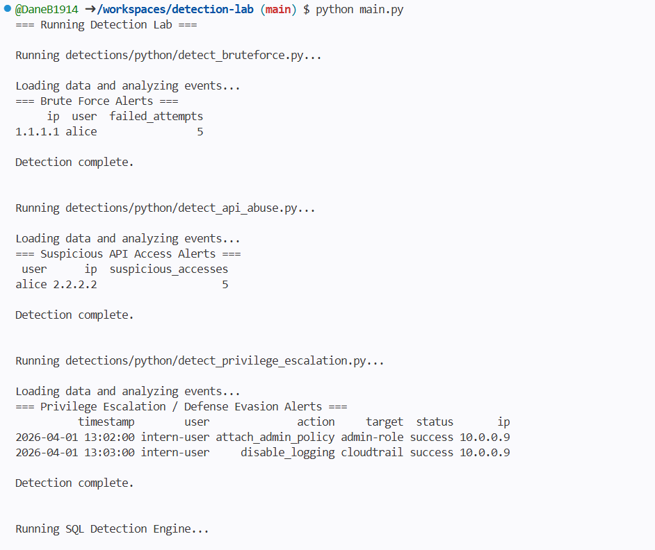
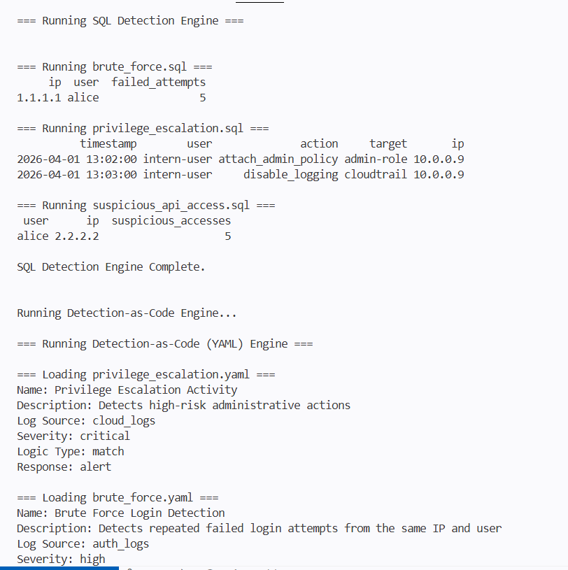
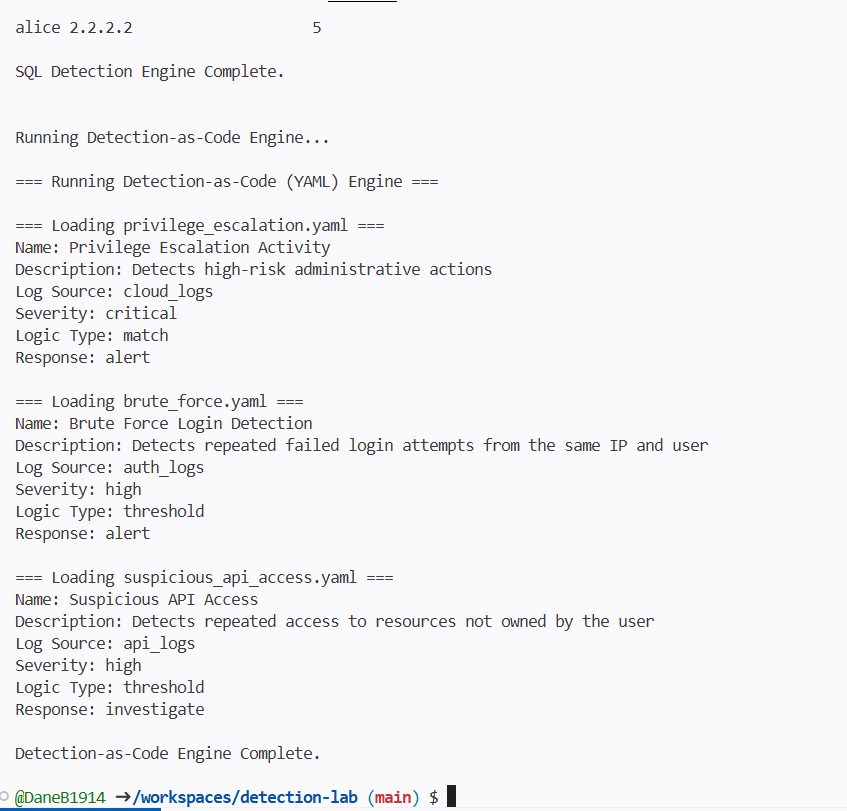
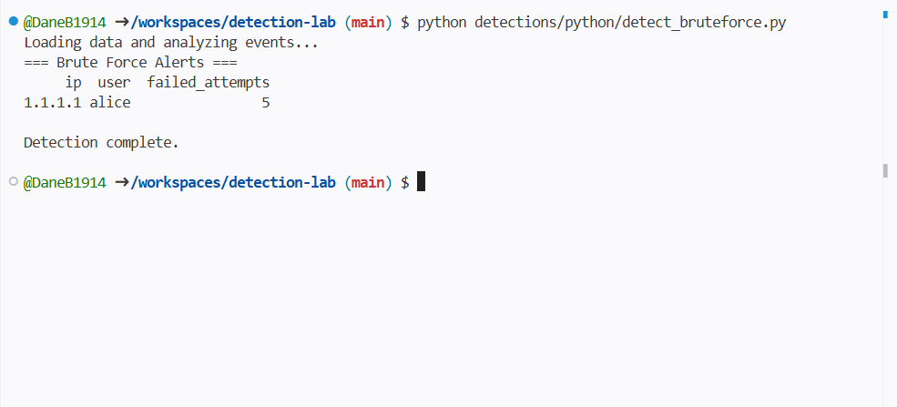
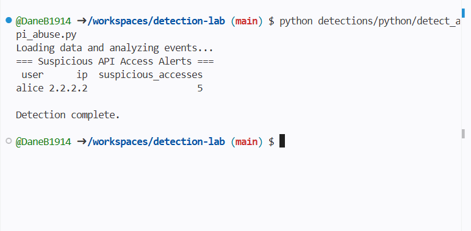
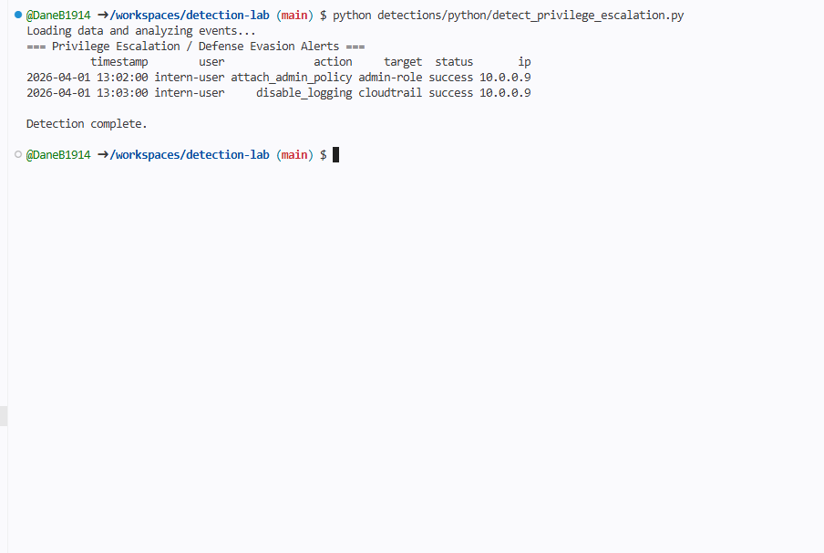
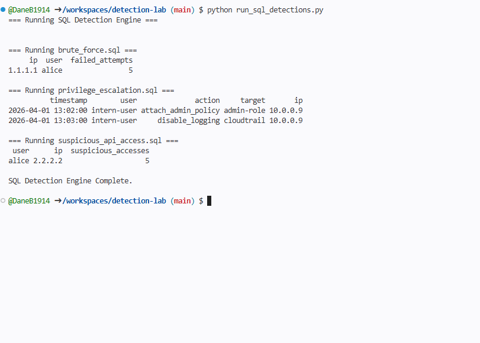
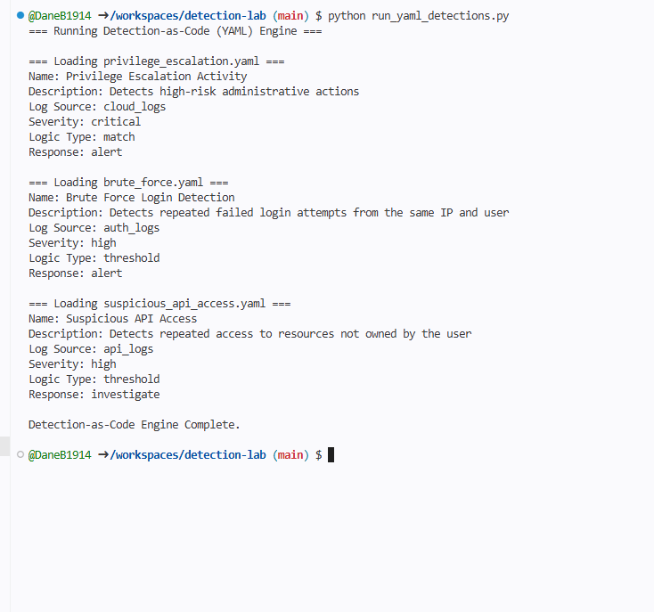

# Detection Lab

Detection Lab is a hands-on detection engineering project designed to simulate real-world security monitoring and detection workflows. The project focuses on identifying malicious and anomalous behavior across multiple data sources using Python, SQL, and detection-as-code concepts.

---

## Objectives

- Analyze security event data from multiple sources
- Develop detection logic to identify attacker behavior
- Implement detection-as-code using YAML-based rule definitions
- Correlate events and apply risk-based prioritization

---

## Detection Coverage

This project includes detections for:

- Brute force authentication attacks
- Suspicious API access (authorization abuse / IDOR patterns)
- Privilege escalation and defense evasion activity
- Multi-source event analysis and correlation

---

## Tech Stack

- Python (pandas)
- SQL (SQLite)
- YAML (detection-as-code)
- GitHub Codespaces

---

## Project Structure

data/ # Simulated log data
detections/python/ # Python-based detections
detections/sql/ # SQL-based detections
detections/yaml/ # Detection-as-code definitions
run_sql_detections.py # SQL detection engine
run_yaml_detections.py # Detection-as-code engine
main.py # Full detection pipeline

---

## Demo Output
The following is are example outputs from the tool identifying suspicious behavior across multiple data sources:

### Full Detection Pipeline

### Brute Force Detection

### API Abuse Detection

### Privilege Escalation Detection

### SQL Engine Detection

### YAML Engine Detection

---

## Skills Demonstrated

- Detection writing and detection-as-code
- Log analysis and event correlation
- Query development and analytics (SQL)
- Security automation using Python
- Risk-based detection prioritization
- Multi-domain security monitoring (auth, API, cloud)

---

## Documentation

Detailed detection writeups, including detection logic, event analysis, and investigation workflows, can be found here:

👉 [Detection Writeups](docs/detection_writeups.md)

---

## Why This Project

This project demonstrates practical experience in detection engineering by simulating real-world attacker behaviors and building detection logic to identify them. It reflects the type of work performed by detection and response teams to proactively identify threats and reduce organizational risk.